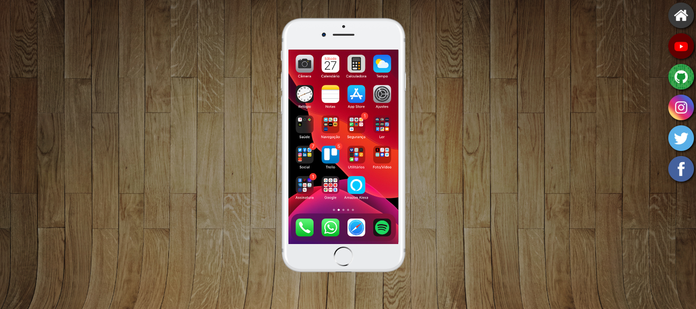

# Projeto redes sociais

## 📌 About ##
 

 Português:   
O projeto consiste em uma interface desenvolvida utilizando HTML e CSS, que simula a tela de um celular. No centro da tela está o dispositivo móvel, com um fundo fixo e ícones dispostos à direita. Cada ícone representa uma rede social e possui uma animação ao passar o mouse sobre ele. A funcionalidade dos ícones é enviar uma tela correspondente à rede social selecionada para o celular, utilizando a tag '&lt;iframe&gt;'. Os usuários podem navegar pelas páginas das redes sociais simuladas no celular usando a rolagem do mouse.

English:  
The project consists of an interface developed using HTML and CSS, which simulates a mobile phone screen. In the center of the screen is the mobile device, with a fixed background and icons arranged on the right side. Each icon represents a social media platform and features an animation when hovered over. The functionality of the icons is to display a corresponding screen of the selected social media platform on the phone, using the '&lt;iframe&gt;' tag. Users can navigate through the simulated social media pages on the phone using mouse scrolling.

## ⚒️ Tools 

- HTML5    
&nbsp;

- CSS3    
&nbsp;

## 💻 Preview <a href="https://pceraa.github.io/projeto-redes-sociais//" target="_blank">🔗</a>

## 📃 License 

This project is under the MIT license. See the file [LICENSE](./LICENSE) for more details
